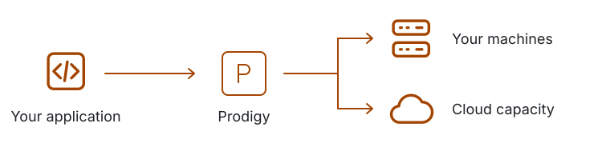

<h1 align="center"><br>Prodigy</h1>

<p align="center"><strong>Your applications. Your machines. One orchestrator.</strong><br>Provision machines, deploy applications, and manage their lifecycle together.</p>

<p align="center">
<a href="prodigy/docs/start/first-service.md"><picture><source media="(prefers-color-scheme: dark)" srcset="assets/readme/try-dark.svg"></picture></a>
&nbsp; <a href="prodigy/docs/README.md">Documentation</a>&nbsp;·&nbsp;<a href="examples/hello-prodigy/">Examples</a>
</p>

<p align="center">Early-stage software for evaluation. Runtime integration required; OCI images need adaptation.</p>

<p align="center"></p>

<p align="center"><strong>Run → inspect → update → remove</strong><br><a href="prodigy/docs/start/first-service-transcript.md">Watch the walkthrough · Read the transcript</a></p>

## Run your first service

The example brings a real HTTP application, two versions, and matching runtime tools. Explore a disposable one-machine cluster without a cloud account or writing application code.

[Prepare the evaluation bundle](prodigy/docs/start/install.md), open its directory, and run:

```bash
./try-prodigy
```

Keep it running. In another terminal, use `./try-prodigy status` to inspect the service and `./try-prodigy update` to change its response from **v1** to **v2**. Press **Ctrl-C in the first terminal** to remove the cluster; on macOS, the launcher also stops its guest.

The candidate currently requires a source build and a supported Linux guest; Apple Silicon uses Apple Containers. [Requirements and availability](prodigy/docs/start/install.md) · [Complete tutorial](prodigy/docs/start/first-service.md).

## Why Prodigy

<p align="center"><picture><source media="(prefers-color-scheme: dark) and (max-width: 480px)" srcset="assets/readme/flow-mobile-dark.svg"><source media="(max-width: 480px)" srcset="assets/readme/flow-mobile-light.svg"><source media="(prefers-color-scheme: dark)" srcset="assets/readme/flow-dark.svg"></picture></p>

<picture><source media="(prefers-color-scheme: dark)" srcset="assets/readme/machines-dark.svg"></picture>&nbsp; **Manage the machines and the applications.**<br>Provision capacity, place workloads, and manage their lifecycle through one system—across machines you own and infrastructure-provider adapters.

<picture><source media="(prefers-color-scheme: dark)" srcset="assets/readme/runtime-dark.svg"></picture>&nbsp; **Give applications the context they need.**<br>Deliver configuration, topology, credentials, and resource changes directly to workloads. The included example already implements the required runtime integration.

<picture><source media="(prefers-color-scheme: dark)" srcset="assets/readme/lifecycle-dark.svg"></picture>&nbsp; **Keep deployment and traffic in step.**<br>Coordinate where instances run, how requests reach them, and when they start, update, and stop.

[How Prodigy works](prodigy/docs/understand/architecture.md) · [Compare with Kubernetes and Nomad](prodigy/docs/understand/comparison.md)

## Make it yours

<picture><source media="(prefers-color-scheme: dark)" srcset="assets/readme/application-dark.svg"></picture>&nbsp; **[Build an application →](prodigy/docs/build-applications/first-application.md)**<br>Start with the example source, then integrate your own workload.

<picture><source media="(prefers-color-scheme: dark)" srcset="assets/readme/machines-dark.svg"></picture>&nbsp; **[Use your machines →](prodigy/docs/run-clusters/private-machines.md)**<br>Bring hardware you operate into the cluster.

<picture><source media="(prefers-color-scheme: dark)" srcset="assets/readme/cloud-dark.svg"></picture>&nbsp; **[Create cloud capacity →](prodigy/docs/run-clusters/cloud.md)**<br>Provision machines through Prodigy's infrastructure-provider adapters.

---

[Current status](prodigy/docs/start/status.md) · [Contributing](CONTRIBUTING.md) · [Support](SUPPORT.md) · [Security](SECURITY.md) · [Apache-2.0](LICENSE)
