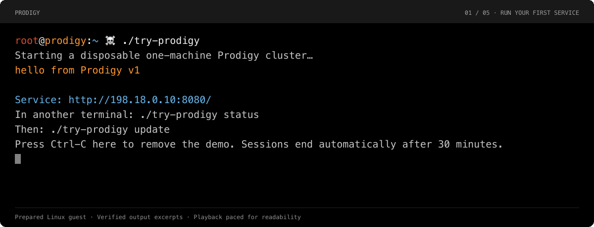

<p align="center">
  
</p>

# Prodigy

**Your applications. Your machines. One orchestrator.**

Prodigy brings machine provisioning, application deployment, routing, and lifecycle management into one system.

Run your first service, inspect it, and deploy an update. Then explore running your applications on machines you own or cloud infrastructure.

**[Try Prodigy →](prodigy/docs/start/first-service.md)** · [Documentation](prodigy/docs/README.md) · [Example source](examples/hello-prodigy/)

Early-stage, open-source software for evaluation. Every application integrates with Prodigy's runtime protocol through an SDK or a direct implementation; existing OCI images require adaptation. The example includes that integration so you can explore the system before writing application code.

## Run your first service

The evaluation bundle contains a small HTTP application, two application versions, and matching runtime tools. It runs a disposable one-machine cluster without cloud credentials or application compilation.

[Install the evaluation bundle](prodigy/docs/start/install.md), open its directory, and run:

```bash
./try-prodigy
```

Keep that terminal open. The launcher creates the cluster, deploys the example, waits for a real HTTP response, and prints the service URL. In another terminal in the same directory:

```bash
./try-prodigy status
./try-prodigy update
```

The application changes its response from `hello from Prodigy v1` to `hello from Prodigy v2`. Press **Ctrl-C in the first terminal** to remove the demo. On macOS, the launcher also stops its guest. The [complete tutorial](prodigy/docs/start/first-service.md) explains each step and the underlying Mothership commands.

**Requirements:** a prepared Linux environment with kernel 7.0 or newer; Apple Silicon Macs use the approved Apple Containers environment. Python 3 and the platform prerequisites are listed in the installation guide. These are evaluation candidates; [current status](prodigy/docs/start/status.md) records what has been verified and whether a downloadable release is available.



[Text transcript and recording details](prodigy/docs/start/first-service-transcript.md).

## Why Prodigy

**Manage machines alongside applications.** Machine provisioning, bootstrap, application placement, and capacity lifecycle share a control model. You can describe machines you own or capacity obtained through infrastructure-provider adapters.

**Give workloads useful runtime information.** The application protocol delivers startup configuration, topology, resource changes, credentials, and lifecycle events. Applications report readiness after they can serve requests. SDKs provide implementations in C, C++, Rust, Go, Python, and TypeScript.

**Coordinate placement, networking, and lifecycle.** Prodigy connects the decisions about where an application runs with how traffic reaches it and how its instances start, change, and stop. The [architecture guide](prodigy/docs/understand/architecture.md) explains the components when you need that detail.

This integration requires application participation. The [Kubernetes and Nomad comparison](prodigy/docs/understand/comparison.md) explains that tradeoff alongside ecosystem maturity and workload compatibility.

## Take the next step

| You want to… | Go here |
|---|---|
| Bring your own application | [Build your first application](prodigy/docs/build-applications/first-application.md) |
| Use machines you already own | [Private infrastructure](prodigy/docs/run-clusters/private-machines.md) |
| Have Prodigy provision cloud capacity | [Cloud deployment](prodigy/docs/run-clusters/cloud.md) |

The example's source, artifact recipe, and deployment plans are included so you can trace a running service back to its inputs. Operational guides cover inspection, updates, credentials, networking, and removal; detailed schemas and protocol contracts stay in reference documentation.

## Project and documentation

Start with the [documentation index](prodigy/docs/README.md) or [current capabilities and limits](prodigy/docs/start/status.md). For source builds and contributions, read [Contributing](CONTRIBUTING.md). Questions and bug reports go through [Support](SUPPORT.md); vulnerability reports follow [Security](SECURITY.md).

Prodigy is licensed under [Apache-2.0](LICENSE).
